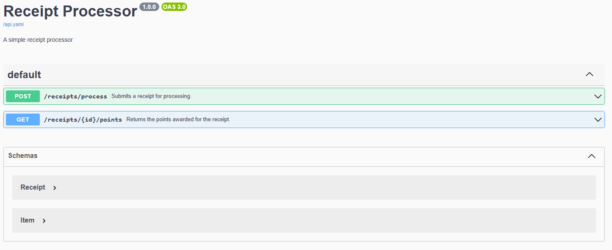

# Receipt Processor API

Java Spring Boot RESTful web service that processes receipts and calculates points based on the receipt.

This application exposes two HTTP endpoints

### Endpoint: Process Receipts

* Path: `/receipts/process`
* Method: `POST`
* Payload: Receipt JSON
* Response: JSON containing an id for the receipt.

Example Payload:

```json
{
  "retailer": "Walgreens",
  "purchaseDate": "2022-01-02",
  "purchaseTime": "08:13",
  "total": "2.65",
  "items": [
    {"shortDescription": "Pepsi - 12-oz", "price": "1.25"},
    {"shortDescription": "Dasani", "price": "1.40"}
  ]
}
```
Example Response:
```json
{ "id": "7fb1377b-b223-49d9-a31a-5a02701dd310" }
```

### Endpoint: Get Points

* Path: `/receipts/{id}/points`
* Method: `GET`
* Response: A JSON object containing the number of points awarded.

A simple Getter endpoint that looks up the receipt by the ID and returns an object specifying the points awarded.

Example Response:
```json
{ "points": 32 }
```

---

# Running Instruction

### Build the Docker image:
```
docker build -t receipt-processor .
```
### To Run the Docker container:
```
docker run -p 8080:8080 receipt-processor
```
After building the application, you can run it using Docker. The RESTful endpoints will be available at `http://localhost:8080`. 

#### Available Endpoints: 

`POST http://localhost:8080/receipts/process` – Save a receipt and receive a generated ID.

`GET http://localhost:8080/receipts/{id}/points` – Get points awarded for the receipt by ID.

## Swagger UI is also available for interactive API testing

The Swagger UI populates the UI from the provided OpenAPI spec `api.yaml` provided.



Access the Swagger UI in the browser:
```
http://localhost:8080/swagger-ui/index.html
```
### Instructions:
In order to use an endpoint, click `Try it out` and enter in the valid JSON data in the POST request and valid id in the GET request. If the request is invalid, the server will handle it accordingly.  
